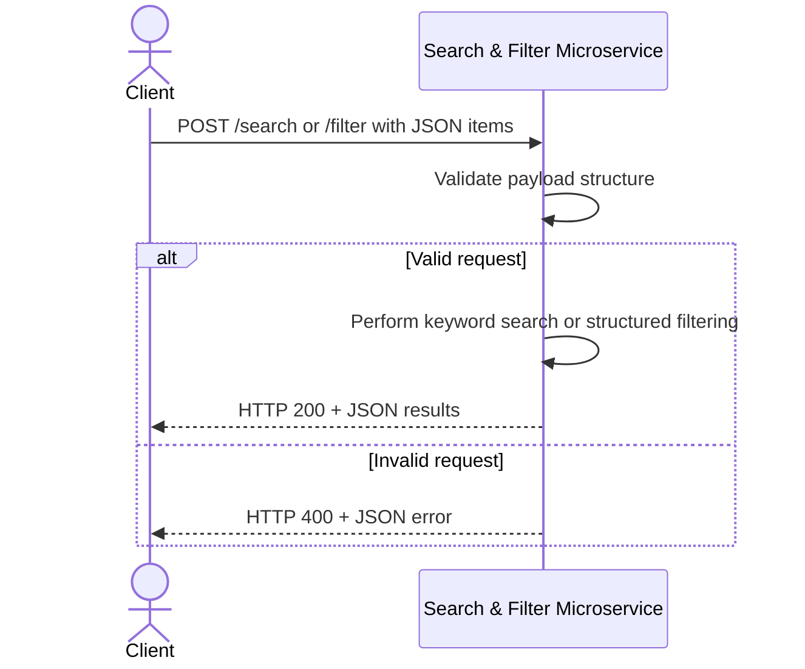

# Search & Filter Microservice

## A) What this microservice does
This microservice performs keyword search and structured filtering over a list of items provided by a client program. It centralizes search and filter logic so main programs do not need to implement it locally.

## How to run locally
```bash
python -m pip install -r requirements.txt
python app.py
```
In another terminal:
```bash
python test_client.py
```

## B) How to REQUEST data
### Endpoint 1
- Method: `POST`
- Path: `/search`
- Content-Type: `application/json`

Required JSON fields:
- `items` (list of objects)
- `query` (string)

### Endpoint 2
- Method: `POST`
- Path: `/filter`
- Content-Type: `application/json`

Required JSON fields:
- `items` (list of objects)
- `filters` (object)

### Example request
```python
import requests
payload = {
  "items": [
    {"id": 1, "title": "CS 361 Sprint Plan", "category": "assignment", "status": "Not Started"},
    {"id": 2, "title": "Living Room Light", "category": "device", "status": "Offline"}
  ],
  "query": "Light"
}
resp = requests.post("http://127.0.0.1:5003/search", json=payload, timeout=2)
print(resp.status_code, resp.json())
```

## C) How to RECEIVE data
Response type: JSON

### Example success response
```json
{
  "query": "Light",
  "results": [
    {"id": 2, "title": "Living Room Light", "category": "device", "status": "Offline"}
  ],
  "count": 1
}
```

### Example error response
```json
{
  "errorCode": "INVALID_REQUEST",
  "message": "items must be a list.",
  "details": {"field": "items"}
}
```

## D) UML Sequence Diagram

